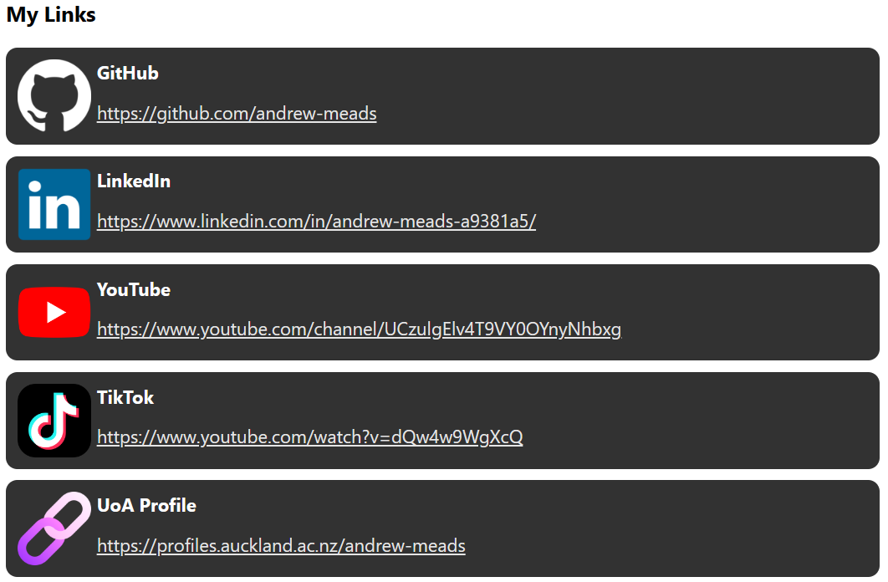
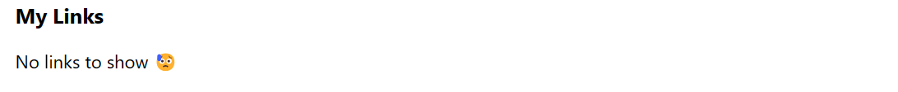
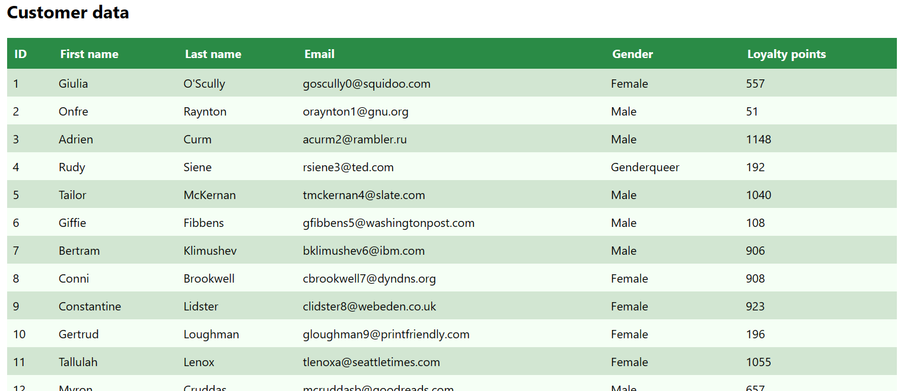
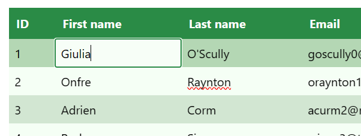
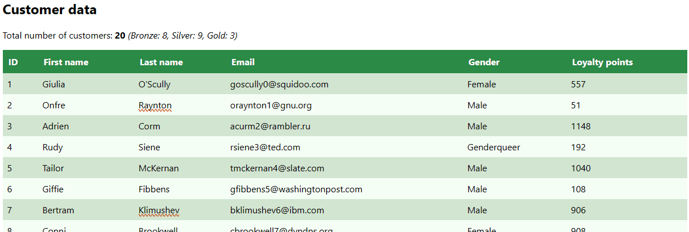

# COMPSCI 719 Lab: Svelte II

In this lab, we'll continue gaining experience with Svelte, along with its recommended framework, SvelteKit. We will cover concepts such as logic blocks, data binding, custom events, and stores.

Before starting, remember to run `npm install` in the root directory (the same one as this README) in order to install this project's dependencies.

## Exercise One - A List of Links

For our first exercise, we'll build components which display a list of links - similar to the website [Linktree](https://linktr.ee/). Do do this, we'll be practicing the following new concepts:

- Displaying slightly more complex data, rather than just single strings or numbers
- Conditional rendering with `{#if}`
- Looping with `{#each}`

You'll notice the following line in the imports section of `+page.svelte`:

```js
import { links } from "$lib/js/links.js";
```

That line imports the `links` array from the `lib/js/links.js` file. Check out that file to see its contents (I put it in its own file so as to not clutter up `+page.svelte`).

Each link in the array has the following structure:

```js
{
  name: 'GitHub',
  icon: './icons/icon-github.png',
  url: 'https://github.com/andrew-meads'
},
```

The `name` is simply text which should be displayed to the user. The `icon` points to an image which can be displayed using an ``'s `src` attribute. There are several icon images included in the `static/icons` folder, many of which have been used here. Finally, the `url` is the actual link we want the user to be able to click, and should be used in the `href` attribute of an `<a>` element.

### Displaying a single item

Before we try to display the whole list of links, let's design a component to display a _single_ link.

1. Create a new component called `LinkListItem.svelte`.

2. Give it a _prop_ (using `export`), called `link`. This prop's value will be set to one of the link objects as shown above. Don't worry about a default value for the prop, as it doesn't really make sense.

3. Create some HTML within the component which will:

   - Display the `name` of the given link.
   - Display a hyperlink whose `href` is set to the given link's `url`. This could also display the name to the user, or it could be separate - it's up to you.
   - Display an `` whose `src` is set to the given link's `icon`. **However,** some provided links might not have supplied icons (see the last link in the array in `links.js` for an example). In that case, instead display the following image: `./icons/icon-default.png`.

     **Hint:** JavaScript's [Nullish coalescing operator (??)](https://developer.mozilla.org/en-US/docs/Web/JavaScript/Reference/Operators/Nullish_coalescing) will be very useful here!

4. Test your component by importing it into `+page.svelte` for now, and rendering it using one of the elements in the `links` array. For example:

   ```svelte
   <LinkListItem link={links[0]} />
   ```

   Make sure to test that your component works with links that have `icon`s defined, and also with those that don't.

5. Style your component using local CSS. You can see an example below - but you definitely don't have to make it look the same as that! One thing you probably _will_ want to do is resize the images - they're pretty large by default! It might also pay to give the component a dark-ish background and light-colored text, as the GitHub icon is completely white and won't show up at all on a white background.

### Displaying a list

Now that we've built a component to handle displaying a single link, we'll build another component allowing us to display the whole list!

1. Create another component, called `LinkList.svelte`.

2. Give it a prop, called `links`. Its default value should be an empty array `[]`. We will end up supplying our `links` array to this component from `+page.svelte` through this prop.

3. Import your `LinkListItem` component, as we'll be using that to display each individual link.

4. In `+page.svelte`, remove your use of your single `LinkListItem` (and its associated import). Now, import your `LinkList`, and render it, supplying the `links` array as a prop.

5. Back in `LinkList.svelte`, using Svelte's [`{#each}` block](https://svelte.dev/docs/logic-blocks), render one `LinkListItem` component for each element in the `links` array. **Important:** When looping through the link data with an `{#each}` block, it's definitely a good idea to use a **keyed #each block**. This will let Svelte more easily determine which list items correspond to which links, to increase efficiency. We can use each link's `name` as the unique property for that link. For example:

   ```svelte
   {#each links as link (link.name)}
     <LinkListItem {link} />
   {/each}
   ```

6. Using Svelte's `{#if}` / `{:else}` blocks, check whether the `links` array exists and has a `length` greater than `0` (`links && links.length > 0`). If so, render the `LinkListItem`s as above. Otherwise, instead render a message letting the user know that there are no links to display. Test both of these cases by modifying `+page.svelte` to supply either the `links` array, or nothing.

7. Apply any final CSS styles to both `LinkList` and `LinkListItem` to make them look however you like.

Here's an example of the finished product (yours will look different, depending on your CSS):

With links:


Without links:


After completing this exercise, take time to reflect on what you did. In this exercise, not only did you get practice with Svelte logic blocks and displaying more complex data, but you also exercised another key facet of _component-based design_.

You didn't just shove all your logic into `+page.svelte`. You didn't even just create a single `LinkList` component with all of this exercise's code! You broke the task down into smaller steps - first building a component to render a _single_ link, and then building _another_ component, which _uses_ your first component to display the whole list.

Doing this makes each individual component much easier to understand, because each only has a single responsibility. When developing with Svelte in the future, if you notice a single component getting too unweildy, consider how you can _refactor_ your code out into multiple components with smaller, more well-defined responsibilities. You will thank yourself!

## Exercise Two - A signup form

In this exercise, we'll start working on a simple signup form. Currently, the `SignupForm` component is rendered on the homepage, and contains three fields - one each for "username", "password", and "repeat password". These inputs currently do nothing. We also see three `<span>`s with error messages. Don't worry about these for now - we'll get those working properly in Exercise Three.

In this exercise, we'll add some _bound_ variables to keep track of the three input values, and display them to the user when the submit button is clicked.

1. Create three variables to store the three values.

2. Using the `bind:` directive, bind each of your three variables to the `value` prop of each of the three `<input>`s, respectively. For example, for the "username" input, we might have the following:

   ```svelte
   <script>
     let username;
   </script>

   <input type="text" name="username" bind:value={username} />
   ```

3. Handle the `<form>`'s `submit` event, preventing the default submit operation (check out the [documentation for the `on:` directive](https://svelte.dev/docs/element-directives) for an easy way to do this). On submit, simply display the entered username and password to the user, in an alert box.

## Exercise Three - Form validation

In this exercise, we will improve the `SignupForm` with some form validation. We will modify our code so that the three error messages only appear when the user's current input is actually violating those conditions, and we'll prevent the user from submitting the form if there are any errors.

1. Decide what the conditions for a valid username and a valid password should be. This is entirely your choice.

   - For my model solution, I decided that valid usernames should be at least four characters in length, and that valid passwords should be at least 6 characters in length and have at least one uppercase letter, lowercase letter, number, and symbol.

   - If you want a challenge, you can use the above password rules too. If you want something easier, you can just use something simple like "Your password must be at least six characters long".

2. Modify the text in the error message `<span>`s to match your decision above.

3. Using **reactive declarations (`$:` syntax)**, write boolean expressions which test for the validity of the username and password. We use reactive declarations so they are automatically recalculated whenever the user changes the entered username / password. Also write a third expression to test that the password and the repeat password match. As an example, consider the following expression, for testing whether the two passwords match:

   ```js
   let password = "";
   let repeatPassword = "";

   $: passwordsMatch = password === repeatPassword;
   ```

   **Hint:** If you have complex rules for a valid password, it might pay to use some [regular expressions](https://developer.mozilla.org/en-US/docs/Web/JavaScript/Guide/Regular_expressions) - particularly [character classes](https://developer.mozilla.org/en-US/docs/Web/JavaScript/Guide/Regular_expressions/Character_classes). For example, the following expression would be `true` if the password contains at least one uppercase letter. You could chain these together to test for multiple different types of characters:

   ```js
   $: containsUppercase = /[A-Z]/.test(password);
   ```

4. Using `{#if}` blocks, make the `<span>`s display _only if_ the associated `<input>` is _not empty_, _and_ contains a valid value (based on your declarations above).

5. Write one final reactive declaration that is `true` if the form is filled out correctly. The form is considered to be filled out correctly if both the username and password are valid, and the two passwords match.

6. Modify your form submission handling logic you wrote in Exercise Two. If the form is filled out correctly, display the username and password as before. Otherwise, if the form is not filled out correctly, display an alert telling the user to fix the errors before submitting.

7. As an alternative to 6. above, instead try doing this in a more user-friendly way than an `alert()` box. For example, you could disable the submit button until the form is complete (and potentially also display a message on the page letting the user know why the button is disabled).

## Exercise Four - Custom events

In this exercise, we will add a custom event to our `SignupForm` so that a parent component can listen for this event to know when the user has clicked the submit button with a fully complete form.

1. Import Svelte's `createEventDispatcher` function, and call it to create our `dispatch` function which we can use to dispatch custom events.

2. Modify your submission logic from Exercise Three. If the user tries to submit an incomplete form, keep the `alert()` dialog letting the user know. However, if the user tries to submit a complete, valid form, then instead dispatch a custom event containing the username and password.

3. In the homepage `+page.svelte` where `<SignupForm />` is rendered, handle your custom event using `on:<eventName>`, where `<eventName>` is the name of your event. Dispay the username and password to the user here.

## Exercise Five - A Todo List

In this exercise, we'll create a todo list, backed by a [Svelte store](https://svelte.dev/docs/svelte-store). We will walk through the creation of this todo list, plus its store, showing good practices around the use of Svelte stores.

### Creating the store

In this application, each todo item will have three properties: an `id` (UUID string), a `description` (string), and an `isComplete` status (boolean).

First, let's create the store:

1. In `todo-store.js`, create and `export` a new store using Svelte's `writable()` function, which is already imported. The initial value of the store should be the given `INITIAL_TODOS` array. Also `subscribe()` to that todo store, logging any changes to the console.

   - **Hint:** You can subscribe like so. Doing so will log the entire todo list to the console whenever any todo items are added, removed, or changed. You can use this later in this exercise to verify that everything is correct.

     ```js
     todoStore.subscribe((todos) => console.log(todos));
     ```

2. Create and `export` a function called `addTodo()`. This function should take a single string (the todo's description). It should create a new todo object with a random `id`, the given `description`, and `isComplete` set to `false`, and add it to the store.

   - **Hint 1:** You can create a random id using the provided and imported `uuid()` function. For example:

     ```js
     const id = uuid();
     ```

   - **Hint 2:** To update a Svelte store, we call its `update()` function. This function takes a _callback function_ with a single argument, which will be the current value of the store. It should return the new value of the store.

   - **Hint 3:** Remember that the new value of the store should be a _new array_, with the contents of the old array _plus_ the new todo item. You can use the [JavaScript spread operator](https://developer.mozilla.org/en-US/docs/Web/JavaScript/Reference/Operators/Spread_syntax) for this, which we have covered in Module Three.

3. Create and `export` a new function called `toggleTodo()`. This function should take a single `id` as an argument, and should toggle the `isComplete` status of the todo with that `id`, if it exists.

   - **Hint:** Remember that you _always_ must return a full new array with your `update()` callback function. In this case, you can use the `map()` function to create a new array, where each element is the same as before, except the modified todo item. For that one element, create a new object which is the same except has a toggled `isComplete` status.

     This is probably the most difficult part of Exercise Five. Check out the `editFavourite()` function in the "favourite things" store in `example-4-3-stores` to see a great example of how to do this.

4. Create and `export` a new function called `deleteTodo()`. This function should take a single `id` as an argument, and remove the todo with that `id` from the store, if it exists.

   - **Hint:** Again you will need to call your store's `update()` function. This time, you can use the array `filter()` function to help you remove the todo with the matching `id`.

**Final hint:** If you are really struggling with this exercise, make sure you have a look at the "favourite things" example in `example-4-3-stores`. The code you have to write is very similar.

### Creating the `ToDoList` component

Next, let's create the `TodoList` component itself. Create a new component called `TodoList.svelte`, and give it the following functionality:

1. Import the `todoStore` and all three functions you wrote previously in this exercise.

2. Display an unordered list of all todo items. Use `{#each}` along with the `$` syntax for accessing store data (e.g. `$todoStore`) to display one `<li>` per todo item. Use a "keyed each" block as you did in Exercise One. This time, you can use the todo's `id` as the unique value. For testing purposes, initially just display the todo's `description`.

3. Add an `<input type="checkbox">` to each list item, whose `checked` property is set to the todo's `isComplete` status.

4. Add an `on:change` event handler to the checkbox. When it changes, call your `toggleTodo()` function, supplying the changed todo's `id` as an argument.

5. Add a button to each list item. When clicked, the corresponding todo should be deleted by calling your `removeTodo()` function.

6. Outside of your unordered list, add an `<input type="text">` and another button for adding todo items. Create a variable called `description` in your component, and bind that input's `value` to it. Then, add an event handler such that when the "add item" button is clicked, your `addTodo()` function will be called to add a new todo item with the given `description`.

7. Improve your code from 6. above so that when a new todo item is added, the `description` will be cleared. And, if the user clicks the "add" button while the input is blank, no todo item will be added.

8. **Bonus:** Try _Refactoring_ your code. You could have _two_ components - one for displaying the whole `TodoList` plus the "add todo" form, and another for displaying an individual todo item (plus calling the `toggleTodo` and `removeTodo` functions). This might be a better design than having all the UI logic in the one component.

9. **Second bonus:** Style your `TodoList` component to make it pretty!

# Challenges

The exercises in this section are considered _challenges_, and are designed for those of you who have found the rest of the lab easy and wish to extend yourselves. They will not be checked in any lab sign-offs, and are considered harder than any question you might be asked in a test.

Only attempt these if you have finished all other Svelte lab exercises up till this point.

## Challenge Exercise Six - Customer table

For the remainder of this lab, we will work on a system which allows us to display and edit customer data, and also to display customer summary statistics. We will use Svelte stores along with good coding practices to allow this.

### Creating the store

In this exercise, we'll first set up the store which will hold the customer data. Take a look at [`lib/js/customer-store.js`](./src/lib/js/customer-store.js). Here, we can see some customer data, in the `INITIAL_CUSTOMERS` array.

To this file, add and export a new `writable` store, with its initial value set to this `INITIAL_CUSTOMERS` array.

### Creating the customer table

Next, we'll create an HTML table which displays the data in the customer store. Create this table in a new Svelte component called `CustomerTable`. Within this component, import the customer store and display the data contained within.

- **Hint:** Take a look at the provided customer data to see what columns you need in the table.

Once your table is displaying the correct data, add some styles to it. For example, mine looks like the following:



## Challenge Exercise Seven - Editing customer data

In this exercise, we will allow the customer data to be edited. To do this, we can combine the HTML `contenteditable` attribute with Svelte binding. This is a different (but also valid) approach compared to how we handled editing todo items in Exercise Five.

For example, let's say you have the following code from the previous exercise, to display a `<td>` with the customer's first name:

```svelte
<td>{customer.firstName}</td>
```

We would then change it to be an _editable_ cell by setting the `contenteditable` attribute on the `td`, and _binding_ the customer's `firstName` to the `td`'s `innerHTML` attribute, like so:

```svelte
<td contenteditable="true" bind:innerHTML={customer.firstName} />
```

Now, the user can click into that cell, and edit the customer's first name!

Modify the table so that all customer data is editable except the id (first name, last name, email, gender, and loyalty points should be editable).

### Important: Propagation of updates

If we have our customer store imported in the same component as the `contenteditable` cells, then Svelte will be smart enough to _propagate_ any edits back to the store - so that any other components using that store will receive the updated data!

For example:

```svelte
<script>
  import { customerStore } from "$lib/js/customer-store";
</script>

<table>
  {#each $customerStore as customer (customer.id)}
    <tr>
      <td contenteditable="true" bind:innerHTML={customer.firstName} />
    </tr>
  {/each}
</table>
```

The above code will work exactly as intended.

However, if we have moved our `contenteditable` cells into _another_ component, we will have to do _two_ bindings. For example see the below code, where I have moved a customer row into its own `CustomerRow` component. I am binding the `innerHTML` to the customer's `firstName` as before, but then I have an additional bind in my main table file, binding `CustomerRow`'s `customer` prop itself:

- In `CustomerTable.svelte`:

  ```svelte
  <script>
    import { customerStore } from "$lib/js/customer-store";
    import CustomerRow from "$lib/components/CustomerRow.svelte";
  </script>

  <table>
    {#each $customerStore as customer (customer.id)}
      <CustomerRow bind:customer />
    {/each}
  </table>
  ```

- In `CustomerRow.svelte`:

  ```svelte
  <script>
    export let customer;
  </script>

  <tr>
    <td contenteditable="true" bind:innerHTML={customer.firstName} />
  </tr>
  ```

Although remembering to bind twice like this might be a hassle, this is still a good design because we have separated the logic to display one customer from the logic to display the table itself.

Once you've gotten this working, see if you can style the cell the user is currently editing. You can use the `:focus` pseudo-selctor for this purpose, and if you want to change the outline that appears, you can change the `outline` CSS property. Mine looks like below:



## Challenge Exercise Eight - Customer summary statistics (with derived stores)

For our final exercise, we will add summary statistics to our page regarding different types of customers. We are interested in the following information:

1. The total number of customers
2. The number of **gold** customers (those with at least 1000 loyalty points)
3. The number of **silver** customers (those with at least 500 loyalty points but less than 1000)
4. The number of **bronze** customers (those with less than 500 loyalty points).

We will create a _derived_ store that will store these values, and will recalculate them every time the customer data changes.

In our `customer-store.js` file, add an import for `derived`:

```js
import { derived, writable } from "svelte/store";
```

Then, at the bottom of the file, after we define our `customerStore` itself, create and export a new store called `statsStore` using the `derived()` function. The first argument is an _array of_ source stores (which should just contain one element in this case - the `customerStore`). The second argument is a function which will output the summary data based on the input data.

This example will create a new store which will output the total number of customers, and Svelte will make sure the value is recalculated whenever the `customerStore` changes:

```js
export const statsStore = derived([customerStore], ([customers]) => {
  // TODO Calculate your summary stats here

  return {
    totalCustomers: customers.length
  };
});
```

You can use this code as a starting point for your own stats store. To this, add extra code which will calculate the number of gold, silver, and bronze customers, and add them to the returned object. You can do this by declaring a variable to store the number of each type, looping through the `customers` array, and incrementing the variable corresponding to the number of loyalty points that customer has (>=1000, >=500 but <1000, or <500, respectively).

Once complete, create a new Svelte component called `LoyaltyStats`, and import and display it on `+page.svelte`, just above your `CustomerTable` component. Your `LoyaltyStats` component should display the four values from the `statsStore`.

Once complete, you should see the stats displayed on your page. And, when you edit the loyalty points for any customer, you should see those stats automatically update to match. See the following animated gif for an example:


